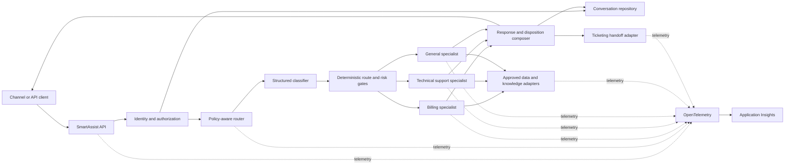

## Research scope

This research translates the [SmartAssist Product Requirements
Document](../prds/smartassist-product-requirements.md) into candidate technical
approaches for:

* Router-to-specialist agent handoff
* Session-level and persistent conversation memory
* Microsoft Foundry deployment
* OpenTelemetry observability for agent systems

The findings reflect official Microsoft and OpenTelemetry material available on
September 20, 2026. Preview and experimental capabilities are identified because
their contracts, limits, or availability may change.

## Executive recommendation

Implement SmartAssist as an **application-hosted Python control plane** that uses
existing Azure OpenAI model deployments through Microsoft Foundry.

The control plane should:

1. Enforce identity, authorization, tenant, risk, and state rules before model
   execution.
2. Use a schema-constrained classifier to propose one of the supported domains.
3. Apply deterministic confidence and policy gates to the proposed route.
4. Invoke a billing, technical support, or general specialist through a common
   typed contract.
5. Retain ownership of the customer conversation and final disposition.
6. Persist authoritative state in an approved application data store.
7. Emit OpenTelemetry traces, metrics, and correlated logs to Application
   Insights without capturing conversation content by default.

Use a specialist as a **tool** when the router should retain control of the turn.
Use an Agent Framework **handoff workflow** only when a specialist must own
multiple turns directly. Use Agent2Agent (A2A) only when a specialist is
independently deployed or owned and protocol-level interoperability justifies
the additional network boundary.

For the MVP, keep session history in a replaceable in-memory or file-backed
repository and use synthetic or de-identified data. For production, move the
same repository contract to a governed Azure data store. Foundry conversations
or Agent Framework sessions may carry model context, but they must not become
the authorization boundary or sole customer record.

## Recommendation summary

| Concern                      | Recommended approach                                                                                     |
| ---------------------------- | -------------------------------------------------------------------------------------------------------- |
| Router ownership             | Deterministic Python control plane owns routing, policy, and final disposition                           |
| Classifier                   | Model-assisted structured output followed by schema, confidence, authorization, and safety checks        |
| Specialist invocation        | Agent-as-tool for bounded single-turn work; handoff workflow for specialist-owned multi-turn work        |
| Remote specialist protocol   | A2A only for independently deployed specialists                                                          |
| MVP memory                   | Repository abstraction backed by in-memory or local file storage with synthetic or de-identified content |
| Production memory            | Governed application store as system of record, with summaries and retrieval as derived data             |
| Foundry deployment           | Application-hosted Python API first; evaluate Hosted Agents through a limited technical spike            |
| Prompt agents                | Suitable for simple specialists and experiments, not the policy enforcement layer                        |
| Observability                | OpenTelemetry end-to-end traces, unsampled metrics, structured logs, Application Insights export         |
| Content telemetry            | Disabled by default; allow only in a separately controlled, redacted diagnostic path                     |

## Decision drivers from the PRD

The recommended architecture prioritizes these requirements:

* Python 3.11 for the core service
* Strict isolation across concurrent sessions
* Deterministic escalation for sensitive and unsupported scenarios
* No successful-looking responses when a dependency fails
* Modular specialist contracts
* Existing Azure OpenAI deployments
* Production persistence, retention, deletion, and audit controls
* Versioned routing, specialist, model, and policy telemetry
* Zero ungrounded account-specific billing claims
* Zero cross-session context leakage

## Reference architecture



The architecture keeps routing authority and customer state outside an
individual model invocation. This separation allows specialists and hosting
options to change without changing the public conversation contract.

## Router-to-specialist handoff

### Candidate patterns

| Pattern                             | Control owner                       | Best fit                                                       | Advantages                                                                             | Trade-offs                                                                      |
| ----------------------------------- | ----------------------------------- | -------------------------------------------------------------- | -------------------------------------------------------------------------------------- | ------------------------------------------------------------------------------- |
| Deterministic application routing   | SmartAssist application             | Known domains, authorization, risk gates, fixed business rules | Predictable, testable, auditable, and independent of model behavior                    | Rule and policy maintenance remains an application responsibility               |
| Specialist as a tool                | Router agent                        | Bounded research or answer generation within one turn          | Router controls shared context and final response; specialist interface remains narrow | Router prompt and tool-selection quality affect delegation                      |
| Agent Framework handoff             | Active specialist                   | Specialist-led multi-turn diagnosis or transfer                | Receiving specialist can continue naturally with conversation context                  | Model-driven transfer is harder to constrain and test than explicit routing     |
| Explicit workflow graph             | Workflow definition                 | Multi-step processes with known transitions                    | Typed paths, conditional edges, checkpoints, and repeatable behavior                   | More orchestration code and workflow-version management                         |
| A2A remote delegation               | Calling agent and remote specialist | Separately deployed or independently owned specialists         | Deployment independence and protocol-level discovery                                   | Added authentication, latency, versioning, availability, and tracing complexity |

### Recommended routing sequence

```text
Receive request
  -> validate API schema and session ownership
  -> load minimum authorized context
  -> apply deterministic pre-routing rules
  -> classify into a typed routing result
  -> validate category and confidence
  -> apply safety, authorization, and escalation policy
  -> invoke one registered specialist
  -> validate specialist result
  -> compose one product disposition
  -> persist state and emit telemetry
```

Deterministic pre-routing should handle conditions that do not require model
judgment, including:

* Invalid or terminal conversation state
* Failed authorization
* Explicit requests for refunds, credits, adjustments, or charge disputes
* Disabled specialists or unhealthy required dependencies
* Requests that exceed product limits
* Channel or tenant restrictions

The classifier should return a typed record rather than free text:

| Field                    | Purpose                                                                   |
| ------------------------ | ------------------------------------------------------------------------- |
| `category`               | One of `billing`, `tech_support`, or `general`                            |
| `confidence`             | Calibrated value used by product policy, not a claim of factual certainty |
| `needs_clarification`    | Indicates that required intent details are missing                        |
| `risk_flags`             | Structured indicators for regulated or restricted scenarios               |
| `candidate_specialist`   | Registered specialist identifier                                          |
| `policy_version`         | Version used to interpret confidence and risk                             |

The router must validate this output against a schema. Unknown categories,
invalid records, low confidence, and conflicting risk flags must produce
clarification or escalation rather than a general-specialist fallback.

### Specialist-as-tool approach

Agent-as-tool delegation is the preferred SmartAssist default. A router invokes a
specialist for a bounded task, receives a typed result, and retains control of the
customer-facing response.

Recommended specialist input:

* Conversation identifier and current message identifier
* Authorized, minimized conversation context
* Customer and tenant claims needed for the task
* Retrieved evidence references
* Requested operation and channel
* Correlation identifier
* Routing and policy versions

Recommended specialist output:

* Specialist identifier and version
* Proposed response
* `answered`, `clarification_required`, or `escalation_required` disposition
* Evidence references
* Escalation reason code
* Tool and dependency outcomes
* Safety-policy outcome

The application must reject malformed outputs and must not translate a specialist
failure into an answered disposition.

#### Benefits

* Central enforcement of security and escalation rules
* A small, testable specialist contract
* Consistent response and disposition formatting
* Reduced duplication of complete conversation history
* Easier replacement of specialist implementations

#### Risks

* The router can become a large prompt with too many tools.
* Propagating a mutable session to every specialist can expose unnecessary state.
* Tool descriptions can cause model-selected misrouting.

Mitigate these risks by keeping routing partly deterministic, limiting the tool
set to the allowed category, passing minimized context, and applying typed output
validation.

### Agent Framework handoff approach

Agent Framework handoff orchestration transfers conversational control from one
agent to another through configured relationships. The receiving agent receives
the conversation context and can continue the interaction. This differs from
agent-as-tool delegation, where the router regains control after the specialist
returns. See the Microsoft guidance for [handoff
orchestration](https://learn.microsoft.com/en-us/agent-framework/workflows/orchestrations/handoff).

Use handoff when:

* Technical diagnosis requires several specialist-led questions.
* A specialist must decide when to return control.
* The customer experience benefits from sustained specialist ownership.

Do not use model-selected handoff as the only control for:

* Tenant or user authorization
* Billing permissions
* Mandatory human escalation
* Fixed compliance or safety rules
* Terminal conversation-state enforcement

If handoff is adopted, restrict the transfer graph to approved edges, add a
maximum handoff count, preserve a deterministic escape path, and record the
source agent, destination agent, reason, and policy version.

### A2A approach

A2A enables communication with a remote agent described by an Agent Card.
Foundry Hosted Agents can expose A2A endpoints. This is useful when specialists
must be separately deployed, scaled, versioned, or owned.

A2A is not recommended for the MVP because all three specialists can share one
Python deployment and one contract. Premature use adds:

* Network latency and partial failures
* Identity propagation and endpoint authorization
* Agent Card discovery and validation
* Protocol-version compatibility
* Distributed tracing requirements
* Independent deployment and rollback coordination

If organizational boundaries later justify A2A, pin the supported protocol
version, authenticate every endpoint, validate advertised capabilities, set
timeouts and circuit breakers, and propagate W3C trace context.

### Recommended handoff decision

Use a two-level model:

1. The SmartAssist application performs deterministic routing and policy checks.
2. The selected specialist runs as a bounded tool for the MVP.

Introduce Agent Framework handoff only for a proven multi-turn specialist use
case. Introduce A2A only when a specialist becomes an independently operated
service.

## Conversation memory strategies

### Memory layers are not interchangeable

| Layer                           | Responsibility                                                  | Lifetime                                     | Recommendation                                     |
| ------------------------------- | --------------------------------------------------------------- | -------------------------------------------- | -------------------------------------------------- |
| API conversation record         | Authorization, tenant ownership, lifecycle, product disposition | Product retention period                     | Authoritative SmartAssist record                   |
| Agent Framework session         | Local orchestration state and provider-specific references      | Conversation or serialized workflow lifetime | Use behind the repository boundary                 |
| Foundry conversation            | Server-side model messages, responses, and tool calls           | Service-managed conversation lifetime        | Use for model continuity, not authorization        |
| Hosted-agent session            | Isolated compute, filesystem, and invocation lifecycle          | Stops on idle; platform expiration applies   | Use for temporary work, not durable customer facts |
| Hosted-agent state store        | Server-backed agent key/value state                             | Configurable service lifetime                | Use for checkpoints if Hosted Agents are selected  |
| Rolling summary                 | Condensed older turns                                           | Derived from authoritative history           | Use to control context size                        |
| Retrieval memory                | Selected facts or relevant prior information                    | Fact-specific retention or time to live      | Use only with provenance, correction, and deletion |
| Audit record                    | Security and business evidence                                  | Governed audit-retention period              | Keep separate from model context                   |

### MVP strategy

Define a `ConversationRepository` interface before selecting the production
store. The MVP implementation may use in-memory or file-backed storage, as the
PRD permits, with these constraints:

* Accept only synthetic or de-identified content.
* Key every operation by the SmartAssist UUID v4 conversation identifier.
* Associate a conversation with its expected test principal.
* Enforce optimistic concurrency or per-conversation serialization.
* Persist state, messages, disposition, routing metadata, and content version.
* Make expiration explicit.
* Avoid implicit process-global conversation state.
* Test repository behavior through a shared contract suite.

In-memory storage is fastest to build but loses state on restart and cannot
support multiple application replicas without affinity. File-backed storage
survives a local restart but introduces locking, corruption, and shared-volume
limitations. Neither is suitable for production.

### Production strategy

Use a governed application data store as the system of record. Select the exact
Azure data service through an architecture decision record based on:

* Access patterns and expected write concurrency
* Transaction and ordering requirements
* Regional availability and recovery objectives
* Encryption and private-network requirements
* Retention, deletion, and GDPR data-subject workflows
* Audit and legal-hold separation
* Cost at expected conversation and message volume

Maintain an application mapping from the external conversation identifier to any
Foundry conversation, response, agent, or hosted-session identifiers. Validate
tenant and user ownership before resuming model context. Microsoft guidance
states that service-side conversation and response identifiers are not an
authorization boundary when credentials are shared across users. See [Agent
Framework sessions](https://learn.microsoft.com/en-us/agent-framework/concepts/agents/conversations/session)
and [Foundry runtime
components](https://learn.microsoft.com/en-us/azure/foundry/agents/concepts/runtime-components).

### Context-window management

Use a tiered context builder:

1. Stable system and specialist instructions
2. Current customer message
3. Recent verbatim turns within a configured token budget
4. A versioned rolling summary of older relevant turns
5. A small set of authorized retrieved facts with provenance

Keep raw authorized history as the source of truth. A summary is lossy and must
not replace audit data. Store the summary's source-message range, generation
time, model or algorithm version, and superseded summary identifier.

Agent Framework supports history compaction, but Python compaction is documented
as experimental at the research cutoff. Hide compaction behind the context
builder interface and test summary fidelity before relying on it.

### Long-term retrieval memory

Foundry Memory can extract and retrieve user profile, chat summary, and
procedural memories. The Memory and Memory Store APIs are preview at the research
cutoff.

Do not make preview memory a launch-critical dependency. If evaluated:

* Place it behind a replaceable `MemoryProvider` interface.
* Scope every read and write by tenant and authorized user.
* Store provenance, confidence, creation time, and expiration.
* Validate writes to reduce prompt-injection and memory-poisoning risk.
* Allow users and administrators to correct or delete memories.
* Never treat retrieved memory as an authoritative billing fact.

### Recommended memory decision

| Release   | Decision                                                                                                                   |
| --------- | -------------------------------------------------------------------------------------------------------------------------- |
| MVP       | Application conversation ID plus repository abstraction; local test storage; recent-turn context; no long-term user memory |
| Pilot     | Governed persistent store; rolling summaries; approved knowledge retrieval; retention and deletion validation              |
| Launch    | Persistent application record remains authoritative; Foundry conversation state is mapped and replaceable                  |
| Later     | Evaluate Foundry Memory only for approved personalization or support continuity use cases                                  |

## Microsoft Foundry deployment options

### Option comparison

| Option                           | Runtime ownership                                                                                              | State and networking                                                                            | Strengths                                                                                                     | Limitations                                                                                                                | SmartAssist fit                        |
| -------------------------------- | -------------------------------------------------------------------------------------------------------------- | ----------------------------------------------------------------------------------------------- | ------------------------------------------------------------------------------------------------------------- | -------------------------------------------------------------------------------------------------------------------------- | -------------------------------------- |
| Foundry prompt agent             | Foundry manages the model and tool loop                                                                        | Foundry conversations and approved project connections; private networking is available         | Fast setup, managed endpoint, built-in tools, low application code                                            | Limited custom orchestration and runtime control; SDK or feature maturity must be verified                                 | Good for simple specialist pilots      |
| Foundry Hosted Agent             | Team supplies Python or .NET code; Foundry manages endpoint, identity, session-isolated compute, and scaling   | Hosted sessions, persistent session filesystem, optional state store, and customer VNet support | Custom orchestration with managed hosting, immutable versions, managed identity, protocol endpoints           | Container compute cost, cold starts, session lifecycle constraints, platform limits, and runtime compatibility to validate | Strong candidate after a focused spike |
| Application-hosted orchestration | Team owns API host, workers, state, scaling, networking, and instrumentation; Foundry supplies model inference | Full control over data stores, identity boundary, network topology, and caching                 | Best deterministic control, integration flexibility, Python 3.11 alignment, and independent component scaling | Highest operational responsibility                                                                                         | Recommended baseline                   |

### Prompt agents

Prompt agents are configured with a model, instructions, and supported tools.
They are appropriate when specialist behavior can be expressed primarily through
instructions and managed tools.

Use prompt agents for:

* Rapid specialist experiments
* Low-complexity general information scenarios
* Comparing prompts or model deployments

Do not rely on a prompt agent as the sole SmartAssist control plane because the
product requires deterministic authorization, state validation, failure
semantics, escalation policy, and integration orchestration.

### Hosted Agents

Hosted Agents run custom code behind managed Foundry endpoints. They support
versioned deployments, managed identity, session-isolated compute, persistent
session files, scaling, and supported agent protocols. See [Hosted Agents in
Foundry Agent
Service](https://learn.microsoft.com/en-us/azure/foundry/agents/concepts/hosted-agents).

Hosted Agents are attractive when Contoso wants to reduce API-hosting operations
while retaining custom agent code. Before selection, a technical spike should
verify:

* Python 3.11 compatibility or an approved runtime change
* Cold-start and idle-resume latency against product objectives
* Per-session compute cost at expected concurrency
* Session expiration behavior and recovery
* Private-network access to billing, knowledge, ticketing, and storage systems
* Identity propagation and least-privilege access
* Scaling limits, quotas, regional availability, and deployment rollback
* End-to-end traces across hosted and external dependencies

Hosted-agent sessions should not hold the only copy of a customer conversation.
Microsoft documents idle compute behavior and platform session expiration, so
durable product state must remain in a governed store.

### Application-hosted orchestration

The application-hosted option runs the Python API and orchestration in a
Contoso-managed Azure compute service and calls existing Azure OpenAI or Foundry
model endpoints.

This option best fits the current PRD because it:

* Directly satisfies the Python 3.11 constraint.
* Keeps authorization and conversation ownership in the application.
* Supports deterministic routing before model execution.
* Allows independent scaling of the API, workers, retrieval, and integrations.
* Simplifies integration with existing REST APIs and messaging.
* Provides full control over data retention and failure semantics.
* Allows OpenTelemetry instrumentation at every boundary.

The cost is greater responsibility for deployment, autoscaling, patching,
networking, resilience, and runtime operations.

### Recommended deployment sequence

1. Build the MVP as an application-hosted Python service using existing Foundry
   model deployments.
2. Keep orchestration, specialist, memory, and telemetry adapters independent of
   the web host.
3. Run a Hosted Agent spike with one non-sensitive specialist before production
   architecture lock.
4. Compare latency, cost, operational burden, networking, runtime compatibility,
   and trace completeness.
5. Retain application hosting unless the Hosted Agent evidence shows a material
   operational advantage without weakening product requirements.
6. Use prompt agents selectively for simple specialists where their managed
   lifecycle reduces complexity.

## OpenTelemetry observability

### Trace topology

Create one root server span for each accepted message request. Recommended child
spans include:

```text
HTTP server request
  -> load conversation
  -> authorize conversation
  -> classify request
  -> apply routing policy
  -> invoke specialist
      -> retrieve evidence
      -> invoke model
      -> execute tool
  -> validate specialist result
  -> persist conversation
  -> create handoff, when required
```

Use the OpenTelemetry Generative AI semantic conventions when stable attributes
exist. Agent, workflow, model, retrieval, memory, and tool operations should
remain separate spans so latency and failure ownership are visible. The
[OpenTelemetry GenAI semantic
conventions](https://github.com/open-telemetry/semantic-conventions-genai)
currently identify their stability status as Development.

Use W3C Trace Context across HTTP, queues, specialists, integrations, and A2A
calls. Preserve the SmartAssist correlation identifier as an application
attribute, not as a replacement for the OpenTelemetry trace identifier.

### Resource attributes

Set consistent resource attributes for every deployed component:

* `service.name`
* `service.namespace`
* `service.version`
* `service.instance.id`
* `deployment.environment.name`
* Azure resource attributes supplied by supported instrumentation

Use distinct service names for the API, background workers, and independently
deployed specialists. This keeps Application Insights service maps and
dependency views meaningful.

### Recommended span attributes

| Category            | Attributes                                                                        |
| ------------------- | --------------------------------------------------------------------------------- |
| Product identity    | Conversation ID, message ID, correlation ID, channel, tenant pseudonym            |
| Routing             | Category, classifier version, policy version, routing outcome, clarification flag |
| Agent               | Agent name, agent version, operation name, disposition                            |
| Model               | Provider, model or deployment, operation, token usage, response identifier        |
| Retrieval           | Source type, index or collection identifier, result count, duration               |
| Tool                | Tool name, version, outcome, duration, retry count                                |
| Handoff             | Reason code, state, target system, completeness result                            |
| Error               | Error type, dependency, retryability, sanitized status                            |

Attribute names should use published GenAI semantic conventions where applicable.
Custom SmartAssist attributes should use a stable namespace such as
`smartassist.routing.category`.

Do not use customer-provided text as a span name, attribute key, conversation
identifier, or high-cardinality metric dimension.

### Metrics

Keep metrics independent of trace sampling:

* Request and conversation counts
* End-to-end and component duration histograms
* Classification and specialist disposition counts
* Clarification and escalation rates
* Model token usage
* Tool and dependency errors
* Timeout and retry counts
* Retrieval result and no-result counts
* Handoff completion and duration
* Active and expired conversations
* Context conflicts and cross-session isolation failures

Business metrics such as autonomous resolution and reopening should be computed
from governed product events or records, not inferred solely from sampled traces.

### Logs and events

Use structured logs and emit them within the active span so trace and span
identifiers are correlated automatically. Log stable event names, sanitized
reason codes, versions, and outcomes.

The OpenTelemetry GenAI conventions define an evaluation result event. Attach
evaluation results to the evaluated operation span or correlate them through the
model response identifier. This supports quality analysis by model, prompt,
specialist, policy, and release.

### Content-capture policy

GenAI input and output events and message-content attributes are opt-in and have
additional privacy risk. The default production configuration should record:

* Non-content identifiers
* Model and deployment names
* Token counts
* Durations and outcomes
* Tool and dependency names
* Routing and policy decisions
* Retrieval counts and source identifiers
* Sanitized errors

It should not record:

* Prompt or response text
* Tool arguments or results containing customer data
* Retrieved document content
* Authentication tokens or secrets
* Raw billing or account details
* Unredacted customer identifiers

If content capture is required for a controlled investigation, use a separate
diagnostic configuration with pre-export redaction, restricted access, short
retention, documented approval, and an auditable enablement period.

### Sampling

For the MVP and low-volume pilot, retain complete non-content traces to validate
span coverage and correlation.

For production:

* Keep operational metrics unsampled.
* Use parent-based sampling so a distributed trace has one coherent decision.
* Start with fixed-percentage or rate-limited sampling supported by Azure Monitor.
* Preferentially retain errors, high-latency requests, and safety-critical
  outcomes when the chosen pipeline supports that policy.
* Introduce tail sampling only if the benefit justifies operating an
  OpenTelemetry Collector.
* Verify that sampling does not remove the evidence required for incident review.

### Application Insights integration

Connect the Foundry project to Application Insights for managed agent traces.
Instrument the SmartAssist Python service with the Azure Monitor OpenTelemetry
distribution or supported OpenTelemetry SDK and exporter. See [Foundry agent
tracing setup](https://learn.microsoft.com/en-us/azure/foundry/observability/how-to/trace-agent-setup)
and [Azure Monitor OpenTelemetry
configuration](https://learn.microsoft.com/en-us/azure/azure-monitor/app/opentelemetry-configuration).

Foundry can emit server-side traces for supported prompt and hosted agents.
Custom application spans should surround routing, policy, persistence, retrieval,
and external API calls so one trace covers the complete customer turn.

Foundry trace analysis uses Application Insights data and GenAI attributes.
Queries should first identify the top-level hosted-agent request, then correlate
dependencies and custom events by W3C operation or trace identifier.

### Observability dashboards

Create separate views for:

* Service health, latency, saturation, and dependency failures
* Model and token consumption by release and specialist
* Routing distribution, low-confidence results, and fallback behavior
* Clarification, escalation, and handoff outcomes
* Safety-policy denials and unsupported billing claims
* Retrieval no-result rates and source failures
* Quality evaluation scores and regressions
* Conversation completion, abandonment, reopening, and satisfaction

Alert on actionable operational conditions rather than individual model
variability. Candidate alerts include sustained error rate, latency objective
breach, unavailable required dependencies, telemetry loss, unusual escalation
changes, and any confirmed context-isolation or billing-fabrication incident.

## Trade-off analysis

### Routing control versus agent autonomy

Greater agent autonomy can produce natural transfers and reduce explicit
workflow code. It also makes authorization, reproducibility, and failure analysis
harder. SmartAssist should grant autonomy only within a policy-approved
specialist boundary.

### Context richness versus privacy and cost

Passing full history can improve continuity but increases token use, latency,
PII exposure, and prompt-injection surface. A minimized context builder with
recent turns, a versioned summary, and sourced facts provides a safer balance.

### Managed hosting versus operational control

Foundry Hosted Agents reduce endpoint and scaling management while introducing
session lifecycle, compute, platform-limit, and cold-start considerations.
Application hosting requires more operations but gives SmartAssist direct control
over state, scaling, network paths, and error semantics.

### Complete traces versus telemetry exposure

Complete non-content traces improve diagnosis. Capturing prompts, responses, and
tool payloads creates substantial privacy and security risk. SmartAssist should
favor structural telemetry and reproduce failures with approved de-identified
evaluation cases.

## Risks and mitigations

| Risk                                        | Consequence                                    | Mitigation                                                                                                  |
| ------------------------------------------- | ---------------------------------------------- | ----------------------------------------------------------------------------------------------------------- |
| Model-directed misrouting                   | Wrong specialist or unsafe response            | Validate typed classifier output and apply deterministic policy and confidence gates.                       |
| Specialist contract drift                   | Runtime failures and inconsistent dispositions | Version schemas, run consumer-contract tests, and reject incompatible registrations.                        |
| Cross-session or cross-tenant access        | Privacy incident                               | Keep ownership mapping in trusted application storage and authorize every state lookup.                     |
| Concurrent updates lose or reorder turns    | Incorrect context                              | Use optimistic concurrency or per-conversation serialization and idempotency keys.                          |
| Summaries omit critical facts               | Incorrect answer or handoff                    | Preserve source history, record summary provenance, and evaluate factual retention.                         |
| Retrieval memory is poisoned or stale       | Repeated incorrect behavior                    | Validate writes, retain provenance, use time to live, and support correction and deletion.                  |
| Preview service dependency changes          | Rework or launch delay                         | Hide preview memory and experimental compaction behind replaceable interfaces.                              |
| Hosted-agent session expiration             | Lost working state                             | Keep authoritative state outside the hosted session and test resume behavior.                               |
| Hosted compute cost or cold starts          | Cost growth or missed latency target           | Run a workload-representative spike and compare against application hosting.                                |
| A2A expands the failure surface             | Higher latency and partial outages             | Adopt only for independent services; add authentication, timeouts, circuit breakers, and trace propagation. |
| Telemetry captures customer content         | Privacy or compliance incident                 | Disable content capture by default and redact before export.                                                |
| Trace sampling hides critical failures      | Incomplete incident evidence                   | Keep metrics unsampled and retain error and safety-critical traces preferentially.                          |
| Semantic conventions change                 | Dashboard and query breakage                   | Pin instrumentation versions and isolate attribute mapping behind a telemetry adapter.                      |

## Validation spikes

Complete these focused spikes before the production architecture decision:

| Spike                                        | Evidence required                                                                                                      |
| -------------------------------------------- | ---------------------------------------------------------------------------------------------------------------------- |
| Router and specialist contract               | Typed routing, deterministic gates, malformed-output rejection, and three specialist adapters                          |
| Concurrent conversation isolation            | Zero content leakage during concurrent turns, retries, expiration, and stale-version updates                           |
| Context summarization                        | Measured factual retention, token reduction, latency, and failure cases on representative conversations                |
| Foundry Hosted Agent                         | Python runtime compatibility, cold-start latency, session recovery, cost, private connectivity, and trace completeness |
| Billing grounding                            | Authorized retrieval, no-result behavior, source outage behavior, and zero unsupported billing claims                  |
| End-to-end OpenTelemetry                     | One correlated trace across API, router, specialist, model, retrieval, persistence, and handoff adapter                |
| Telemetry privacy                            | Verification that default exports contain no prompt text, response text, tool payloads, secrets, or raw PII            |

## Recommended next decisions

1. Approve application-hosted Python orchestration as the MVP baseline.
2. Approve specialist-as-tool as the default delegation mechanism.
3. Define the typed routing and specialist contracts.
4. Select the MVP repository implementation and production-store decision date.
5. Approve context limits, summary behavior, and session expiration.
6. Approve the default no-content telemetry policy.
7. Schedule the Hosted Agent and end-to-end tracing spikes.
8. Record separate architecture decisions for production persistence and hosting
   after spike evidence is available.

## Source notes

### Microsoft Agent Framework

* [Orchestration patterns](https://learn.microsoft.com/en-us/agent-framework/workflows/orchestrations/)
* [Handoff orchestration](https://learn.microsoft.com/en-us/agent-framework/workflows/orchestrations/handoff)
* [Agent conversations](https://learn.microsoft.com/en-us/agent-framework/concepts/agents/conversations/)
* [Agent sessions](https://learn.microsoft.com/en-us/agent-framework/concepts/agents/conversations/session)
* [Conversation storage](https://learn.microsoft.com/en-us/agent-framework/concepts/agents/conversations/storage)
* [History compaction](https://learn.microsoft.com/en-us/agent-framework/concepts/agents/conversations/compaction)
* [Python switch and case workflow sample](https://github.com/microsoft/agent-framework/blob/main/python/samples/03-workflows/control-flow/switch_case_edge_group.py)
* [Python conditional edge sample](https://github.com/microsoft/agent-framework/blob/main/python/samples/03-workflows/control-flow/edge_condition.py)
* [Python agent-as-tool session propagation sample](https://github.com/microsoft/agent-framework/blob/main/python/samples/02-agents/tools/agent_as_tool_with_session_propagation.py)
* [Python A2A agent-as-tool sample](https://github.com/microsoft/agent-framework/blob/main/python/samples/02-agents/a2a/a2a_agent_as_function_tools.py)

### Microsoft Foundry

* [Foundry Agent Service overview](https://learn.microsoft.com/en-us/azure/foundry/agents/overview)
* [Foundry runtime components](https://learn.microsoft.com/en-us/azure/foundry/agents/concepts/runtime-components)
* [Hosted Agents](https://learn.microsoft.com/en-us/azure/foundry/agents/concepts/hosted-agents)
* [Foundry SDK overview](https://learn.microsoft.com/en-us/azure/foundry/how-to/develop/sdk-overview)
* [Migrate from classic agents](https://learn.microsoft.com/en-us/azure/foundry/agents/how-to/migrate)
* [Foundry Memory](https://learn.microsoft.com/en-us/azure/foundry/agents/concepts/what-is-memory)
* [Foundry virtual networks](https://learn.microsoft.com/en-us/azure/foundry/agents/how-to/virtual-networks)
* [Set up tracing for agents](https://learn.microsoft.com/en-us/azure/foundry/observability/how-to/trace-agent-setup)
* [Agent tracing concepts](https://learn.microsoft.com/en-us/azure/foundry/observability/concepts/trace-agent-concept)

### OpenTelemetry and Azure Monitor

* [OpenTelemetry GenAI semantic conventions](https://github.com/open-telemetry/semantic-conventions-genai)
* [GenAI agent spans](https://github.com/open-telemetry/semantic-conventions-genai/blob/main/docs/gen-ai/gen-ai-agent-spans.md)
* [GenAI spans](https://github.com/open-telemetry/semantic-conventions-genai/blob/main/docs/gen-ai/gen-ai-spans.md)
* [GenAI metrics](https://github.com/open-telemetry/semantic-conventions-genai/blob/main/docs/gen-ai/gen-ai-metrics.md)
* [GenAI events](https://github.com/open-telemetry/semantic-conventions-genai/blob/main/docs/gen-ai/gen-ai-events.md)
* [OpenTelemetry sampling](https://opentelemetry.io/docs/concepts/sampling/)
* [OpenTelemetry logs](https://opentelemetry.io/docs/concepts/signals/logs/)
* [Enable Azure Monitor OpenTelemetry](https://learn.microsoft.com/en-us/azure/azure-monitor/app/opentelemetry-enable?tabs=python)
* [Configure Azure Monitor OpenTelemetry](https://learn.microsoft.com/en-us/azure/azure-monitor/app/opentelemetry-configuration)

## Research caveats

* OpenTelemetry GenAI semantic conventions are under active development. Pin
  versions and expect attribute changes.
* Foundry Memory and the Memory Store API are preview at the research cutoff.
* Agent Framework Python history compaction is experimental at the research
  cutoff.
* Workflow and external-agent tracing are preview at the research cutoff.
* A2A v1.0 is generally available, while older v0.3 support remains preview.
* Regional availability, quotas, supported model versions, hosted runtimes, and
  network features must be confirmed in the target subscription before
  implementation.
