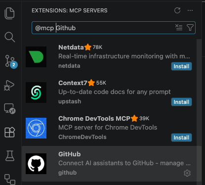
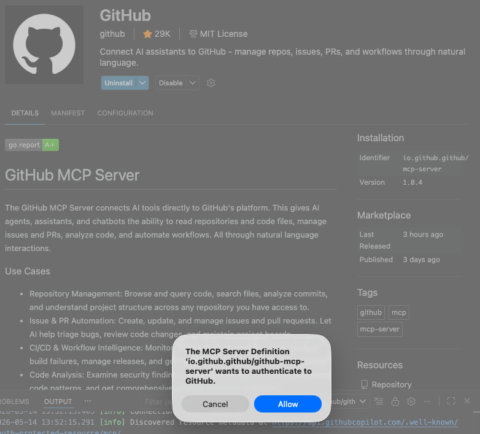
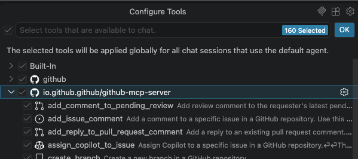

# Challenge 0: Environment Setup and Verification

| | |
|---|---|
| **Duration** | 20 minutes |
| **Objective** | Verify all tools are installed and configured for the workshop |

## Introduction

Before diving into HVE-Core workflows, you need a properly configured development environment. This challenge ensures everyone starts from the same baseline with all required tools installed, authenticated, and ready to use. You will verify your IDE setup, CLI tools, cloud services, and MCP integrations that power the entire workshop.

## Learning Objectives

By the end of this challenge, you will be able to:

- Confirm that VS Code extensions (HVE-Core, GitHub Copilot) are installed and active
- Verify Python, Azure CLI, Azure Developer CLI, GitHub CLI, and Docker are properly configured
- Authenticate against Azure and GitHub services
- Provision an Azure resource group and AI Foundry resource for use in later challenges
- Enable the GitHub MCP server for direct GitHub integration from Copilot Chat
- Access all HVE-Core agents from the Copilot Chat agent picker

## Instructions

### Step 1: Verify VS Code Extensions

Open VS Code and confirm these extensions are installed:

- **HVE Core - All** (`ise-hve-essentials.hve-core-all`) — The core HVE extension
- **GitHub Copilot** — AI pair programming
- **GitHub Copilot Chat** — Chat interface for Copilot
- **Python** — Python language support

```bash
code --list-extensions | Select-String "hve-core|copilot|python"
```
For MacOS -
```bash
code --list-extensions | grep -iE "hve-core|copilot|python"
```

### Step 2: Verify Python Environment

Install Python 3.11+ if needed: <https://www.python.org/downloads/>

```bash
python --version        # Should be 3.11+
pip --version           # Should be available
```

### Step 3: Verify Azure CLI

Install if needed: <https://learn.microsoft.com/cli/azure/install-azure-cli>

```bash
az account show         # Should display your subscription
az login                # If not authenticated
```

### Step 4: Verify Azure Developer CLI (azd)

Install if needed: <https://learn.microsoft.com/azure/developer/azure-developer-cli/install-azd>

```bash
azd version             # Should display the installed version
azd auth login          # If not authenticated
```

### Step 5: Verify GitHub CLI

Install if needed: <https://cli.github.com/>

```bash
gh auth status          # Should show authenticated
```

### Step 6: Verify Docker

Docker is used in Challenge 9 to build and test the container locally before deploying to Azure.

Install if needed: <https://docs.docker.com/get-started/get-docker/>

```bash
docker --version        # Should display the installed version
docker info             # Should show Docker daemon is running
```

### Step 7: Create an Azure Resource Group

Create a dedicated resource group for all workshop resources. Replace `<your-region>` with your preferred Azure region (e.g., `eastus2`, `westus3`, `swedencentral`):

```bash
az group create --name hve-workshop-rg --location <your-region>
```

Verify the resource group was created:

```bash
az group show --name hve-workshop-rg --query "{name:name, location:location, state:properties.provisioningState}" -o table
```

> **Note:** This resource group is used throughout the workshop. Do not delete it until all challenges are complete.

### Step 8: Create an Azure AI Foundry Resource with a Model Deployment

You need an Azure AI Foundry (formerly Azure OpenAI) resource with a model deployment for the evaluation challenge (Challenge 7). Create it now so the deployment is ready by the time you reach that stage.

**Create the Azure AI Services resource:**

```bash
az cognitiveservices account create \
  --name hve-workshop-ai \
  --resource-group hve-workshop-rg \
  --kind AIServices \
  --sku S0 \
  --location <your-region> \
  --yes
```

**Deploy a model (e.g., `gpt-4o`):**

```bash
az cognitiveservices account deployment create \
  --name hve-workshop-ai \
  --resource-group hve-workshop-rg \
  --deployment-name gpt-4o \
  --model-name gpt-4o \
  --model-version "2024-11-20" \
  --model-format OpenAI \
  --sku-name Standard \
  --sku-capacity 10
```

**Retrieve the endpoint for later use:**

```bash
az cognitiveservices account show \
  --name hve-workshop-ai \
  --resource-group hve-workshop-rg \
  --query "{endpoint:properties.endpoint}" -o table
```

> **Note:** Save the endpoint — you will need it in Challenge 7 for LLM-as-judge evaluation calls. Authentication uses Azure AD (`az login`) — key-based auth is not supported.

### Step 9: Enable GitHub MCP Server

The GitHub MCP server lets Copilot interact with GitHub issues, PRs, and repositories directly. Enable it in VS Code:

1. Open the **Extensions** view (`Cmd+Shift+X` / `Ctrl+Shift+X`)
2. In the search bar, type `@mcp github`

   

3. Click **Install** on the GitHub MCP server entry
4. Follow the authentication workflow that appears — sign in with your GitHub account when prompted

   

5. Once installed, switch to **Agent mode** in the Copilot Chat input area
6. Verify the server is running by checking the MCP tool icon in the Copilot Chat panel

   

> **Note:** Requires VS Code 1.101 or later for remote MCP and OAuth support.

### Step 10: Fork the Workshop Repository

Fork the workshop repository to your own GitHub account:

```bash
gh repo fork https://github.com/mcaps-microsoft/hve-core-workshop --clone
cd hve-core-workshop
```

Verify the fork:

```bash
git remote -v   # Should show your fork as 'origin'
```

### Step 11: Verify HVE-Core Agents

Open GitHub Copilot Chat (`Ctrl+Alt+I`) and verify you can see these agents in the agent picker:

- BRD Builder
- PRD Builder
- Task Researcher
- ADR Creation
- GitHub Backlog Manager
- Task Planner
- Task Implementor
- Task Reviewer
- RPI Agent
- Evaluation Dataset Creator

## Success Criteria

- [ ] HVE Core - All extension active in VS Code
- [ ] Python 3.11+ available
- [ ] Azure CLI authenticated with active subscription
- [ ] Azure Developer CLI (`azd`) installed and authenticated
- [ ] Resource group `hve-workshop-rg` created
- [ ] Azure AI Foundry resource created with a `gpt-4o` deployment
- [ ] GitHub CLI authenticated
- [ ] Docker installed and daemon running
- [ ] GitHub MCP server configured in VS Code
- [ ] Workshop repository forked and cloned
- [ ] All HVE Core agents visible in Copilot Chat

## Troubleshooting

| Issue | Solution |
|-------|----------|
| HVE-Core agents not appearing | Reload VS Code window (`Ctrl+Shift+P` → "Reload Window") |
| Azure CLI not authenticated | Run `az login` and select your subscription |
| Azure Developer CLI not found | Install from <https://learn.microsoft.com/azure/developer/azure-developer-cli/install-azd> |
| Resource group creation failed | Ensure your subscription is active: `az account show` |
| AI Foundry deployment failed | Check region availability and quota: `az cognitiveservices account list-skus --kind OpenAI --location <region>` |
| GitHub CLI auth failed | Run `gh auth login` and follow the browser flow |
| Docker daemon not running | Start Docker Desktop or run `sudo systemctl start docker` (Linux) |
| Python version too old | Install Python 3.11+ from python.org |
