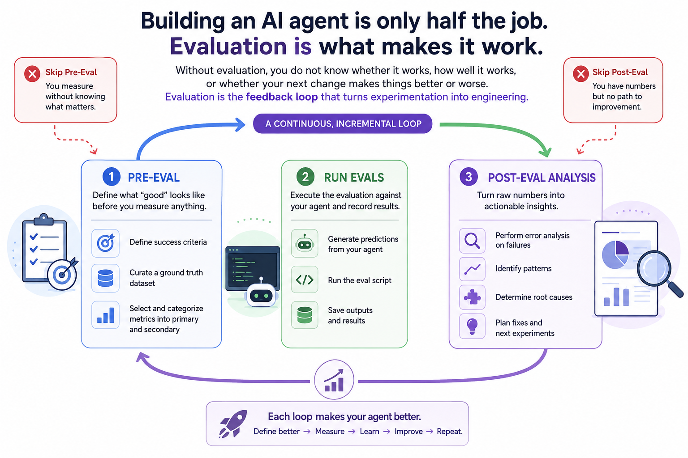
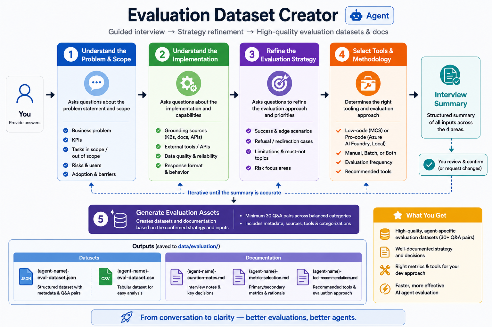
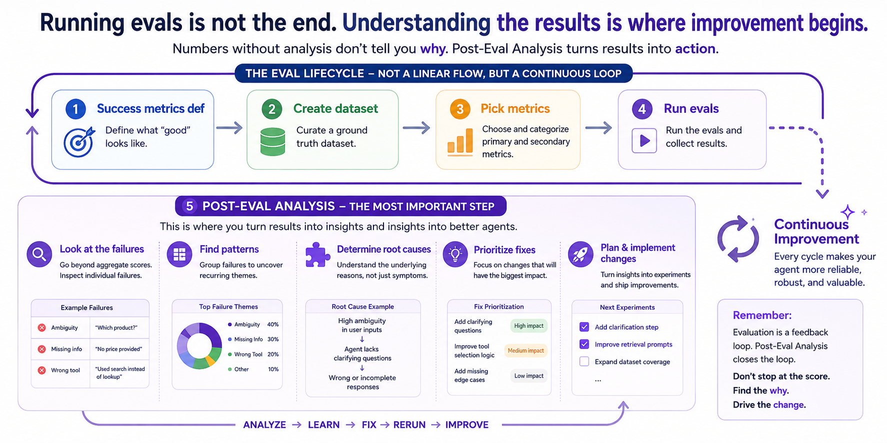

# Challenge 7: First Evaluation Run



| | |
|---|---|
| **Duration** | 50 minutes |
| **Objective** | Use an interview-driven dataset curation workflow to select metrics, generate evaluation data, and run your first eval suite |
| **HVE-Core Stage** | Stage 7: Review (application-level) |
| **Agent** | `Evaluation Dataset Creator` |

> [!IMPORTANT]
> `Evaluation Dataset Creator` is currently part of the pre-release version of the `hve-core all` extension.

## Context

Building an AI agent is only half the job. Without evaluation, you do not know whether it works, how well it works, or whether your next change makes things better or worse. Evaluation is the feedback loop that turns experimentation into engineering.

### The Evaluation Lifecycle

Effective evaluation is not a single step. It follows a lifecycle with three distinct stages:

| Stage | Purpose | Key Activities |
|-------|---------|----------------|
| **1. Pre-Eval** | Define what "good" looks like before you measure anything | Define success criteria, curate a ground truth dataset, select and categorize metrics into primary and secondary |
| **2. Run Evals** | Execute the evaluation against your agent and record results | Generate predictions from your agent, run the eval script, save outputs |
| **3. Post-Eval Analysis** | Turn raw numbers into actionable insights | Perform error analysis on failures, identify patterns, determine root causes, and plan fixes |

Skipping the first stage means you measure without knowing what matters. Skipping the third means you have numbers but no path to improvement. This challenge walks through all three.

### Metric Categories

There are two fundamental approaches to measuring agent quality:

| Metric Category | What It Measures | When to Use |
|-----------------|------------------|-------------|
| **Ground truth based** | Compares agent output against known-correct answers such as routing targets or reference responses | When you have expected answers from SMEs, historical data, or curated synthetic cases |
| **LLM-as-judge** | Uses a separate LLM to score response quality on dimensions such as helpfulness, coherence, safety, and relevance | When exact matching is too rigid or you need subjective quality assessment |

A strong evaluation suite uses both. Ground truth metrics catch factual regressions, while LLM-as-judge metrics catch quality degradation that exact matching would miss.

> [!IMPORTANT]
> The ground truth data you generate in this challenge is for experimentation only. In production, pair this with SME-reviewed cases and historical support data.

## Instructions

### Step 1: Define Success Criteria

Write down what success means for SmartAssist before generating any data or picking metrics. Consider. For example:

* Correct routing on the first attempt
* Factually grounded responses — no fabricated policy details or transaction data
* Consistent quality across billing, technical, and general categories

Keep this short. You will use it next to decide which metrics are primary versus secondary.

### Step 2: Curate the Dataset with Evaluation Dataset Creator



Open a new chat with the **Evaluation Dataset Creator** agent. Attach the PRD at `docs/prds/smartassist-customer-support.md` for richer context.

```text
create an evaluation dataset for SmartAssist, a customer support agent that routes billing issues, technical troubleshooting, general inquiries, escalation cases, and refusal cases such as prompt injection or off-topic requests. As part of the interview, discuss which evaluation metrics are most appropriate for this type of agent and why, and help me categorize them into primary metrics (directly tied to success criteria) and secondary metrics (useful but supplementary). Use local evals only — run evaluations via a Python script, not through Azure AI Foundry or any managed evaluation service. Use Azure OpenAI for any LLM-as-judge calls if needed.
```

Answer the interview questions fully. Use your judgment on the details — the agent will guide you through what it needs.

> [!IMPORTANT]
> If asked about Low-Code vs Pro-Code or Azure AI evaluations, say: "Local-only eval using a Python script — simplest option for this workshop. Use Azure OpenAI for any LLM-as-judge calls if needed."

After the interview, the agent should generate these artifacts under `data/evaluation/`:

```text
data/evaluation/
├── datasets/
│   ├── smartassist-eval-dataset.json
│   └── smartassist-eval-dataset.csv
```

### Step 3: Categorize Metrics and Review the Artifacts

Use the same **Evaluation Dataset Creator** agent to walk through the recommended metrics:

```text
Explain the metrics you selected for SmartAssist and why each one matters. Show me how each metric maps to a quality dimension of the agent.
```

You should end up with a clear split:

* **Primary metrics**: release gates tied to success criteria (e.g., routing accuracy, safety pass rate)
* **Secondary metrics**: improvement signal, not pass/fail (e.g., response similarity, coherence score)

Then inspect the dataset. Aim for **40-50** Q&A pairs covering: easy scenarios, grounding checks, hard/ambiguous cases, refusal scenarios, and safety scenarios. Verify domain coverage spans billing, technical, general, escalation, and adversarial requests. If gaps exist, ask the agent to expand.

> [!NOTE]
> The metric selection document is your source of truth for which metrics matter most.

### Step 4: Run the Evaluation and Record a Baseline

Ask the agent to walk you through the evaluation flow:

```text
Walk me through how to run the local evaluation. Explain what inputs the eval script expects, what outputs it produces, and what commands I need to run. Show me the exact Python commands to execute the evaluation against the dataset in data/evaluation/datasets/. Include instructions for the plumbing needed — specifically, create a prediction script that sends the utterances from the ground truth dataset to my running API/agent, collects the responses, and writes them to a predictions file. Then show me how to run the eval script against those predictions.
```

Follow the commands to run the evaluations and save outputs under `data/evaluation/results/`.

> [!IMPORTANT]
> You may need to run ground truth utterances against your actual system to generate a predictions file (e.g., `predictions.json`) before running the eval script. The exact flow depends on your harness and dataset structure — let the agent guide you through your setup.

Record your baseline metrics in `data/evaluation/docs/smartassist-eval-baseline.md`. 

### Step 5: Error Analysis



Raw scores tell you where you stand; analysis tells you what to do next. This step applies every time you have evaluation results, not just this challenge. Use **Agent Mode**, **Task Researcher** (`/task-research`), or both.

> [!WARNING]
> You must manually review the results yourself. AI analysis misses nuance and can misattribute root causes. Look at inputs, responses, and scores side by side — then use agents to go deeper.

Review the results in `data/evaluation/results/` yourself first. Then use an agent to dig deeper:

```text
Analyze the evaluation results in data/evaluation/results/. For every case where the agent failed or scored poorly, explain what went wrong. Group the failures by category (routing errors, hallucinations, missed escalations, safety failures) and identify any patterns. Which failure types are most frequent? Which are most severe?
```

Cross-check against your own review. Watch for:

* **Routing misclassifications**: which categories get confused?
* **Hallucinations**: fabricated data for specific query types?
* **Missed escalations**: scripted responses instead of handoff?
* **Safety gaps**: adversarial inputs getting through?
* **Surprises**: good scores with subtly wrong responses, or low scores with reasonable ones

### Step 6: Commit

```bash
git add .
git commit -m "test: add evaluation framework with curated dataset and baseline

- Curate evaluation dataset with Evaluation Dataset Creator
- Document metric selection and tool recommendation
- Implement ground truth and LLM-as-judge evaluations
- Record first baseline for SmartAssist

Closes #<issue-number>"

git push
```

## Success Criteria

- [ ] **Success Criteria Defined** — You wrote down what "good" looks like for SmartAssist before generating any data
- [ ] **Dataset Curated** — Evaluation dataset exists under `data/evaluation/datasets/` with meaningful SmartAssist coverage
- [ ] **Metrics Categorized** — You can distinguish your primary metrics (release gates) from secondary metrics (improvement signal)
- [ ] **Evaluation Executed** — You ran the local evaluation flow and results are saved under `data/evaluation/results/`
- [ ] **Baseline Recorded** — `data/evaluation/docs/smartassist-eval-baseline.md` records the initial baseline with your chosen metrics
